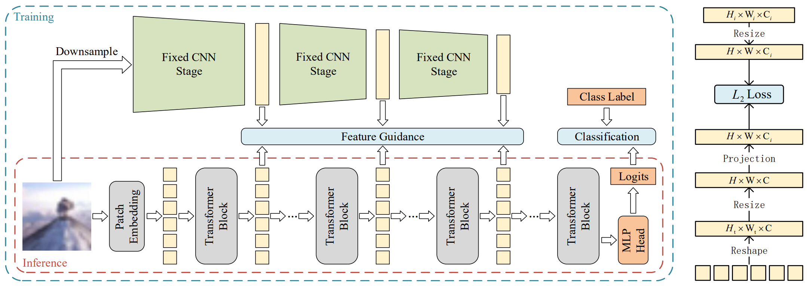

# Locality Guidance for Improving Vision Transformers on Tiny Datasets (ECCV‘2022)

[[arXiv paper]()] | [[ECCV paper]()]



## Description

This is a PyTorch implementation of the paper "Locality Guidance for Improving Vision Transformers on Tiny Datasets", supporting different Transformer models (including DeiT, T2T-ViT, PiT, PVT, PVTv2, ConViT, CvT) and different classification datasets (including CIFAR-100, Oxford Flowers, Tiny ImageNet, Chaoyang).

## Abstract

While the Vision Transformer (VT) architecture is becoming trendy in computer vision, pure VT models perform poorly on tiny datasets. To address this issue, this paper proposes the locality guidance for improving the performance of VTs on tiny datasets. We first analyze that the local information, which is of great importance for understanding images, is hard to be learned with limited data due to the high flexibility and intrinsic globality of the self-attention mechanism in VTs. To facilitate local information, we realize the locality guidance for VTs by imitating the features of an already trained convolutional neural network (CNN), inspired by the built-in local-to-global hierarchy of CNN. Under our dual-task learning paradigm, the locality guidance provided by a lightweight CNN trained on low-resolution images is adequate to accelerate the convergence and improve the performance of VTs to a large extent. Therefore, our locality guidance approach is very simple and efficient, and can serve as a basic performance enhancement method for VTs on tiny datasets. Extensive experiments demonstrate that our method can significantly improve VTs when training from scratch on tiny datasets and is compatible with different kinds of VTs and datasets. For example, our proposed method can boost the performance of various VTs on tiny datasets (e.g., 13.07\% for DeiT, 8.98\% for T2T and 7.85\% for PVT), and enhance even stronger baseline PVTv2 by 1.86\% to 79.30\%, showing the potential of VTs on tiny datasets.

## Usage

### Dependencies

The base environment we used for experiments is:

- python = 3.8.12
- pytorch = 1.8.0
- cudatoolkit = 10.1

Other dependencies can be installed by:

```shell
pip install -r requirements.txt
```

### Data Preparation

**Step 1:** download datasets from their official websites:

- [CIFAR-100](https://www.cs.toronto.edu/~kriz/cifar.html)
- [Oxford Flowers](https://www.robots.ox.ac.uk/~vgg/data/flowers/102/)
- [Tiny ImageNet](https://www.kaggle.com/c/tiny-imagenet)
- [Chaoyang](https://bupt-ai-cz.github.io/HSA-NRL/)

**Step 2:** move or link the datasets to `data/` directory. We show the layout of `data/` directory as follow:

```
data
└── cifar-100-python
|   ├── meta
|   ├── test
|   └── train
└── flowers
|   ├── jpg
|   ├── imagelabels.mat
|   └── setid.mat
└── tiny-imagenet-200
|   ├── train
|       ├── n01443537
|       └── ...
|   └── val
|       ├── images
|       └── val_annotations.txt
└── chaoyang
    ├── test
    ├── train
    ├── test.json
    └── train.json
```

### Train from Scratch

For example, you can train DeiT-Tiny from scratch using:

```shell
python run_net.py --mode train --cfg configs/deit/deit-ti_c100_base.yaml
```

Besides, we provide configurations for different models and different datasets at `configs/`.

### Train with Locality Guidance

**Step 1:** train the CNN guidance model (e.g., ResNet-56). This step will only take a little time and only needs to be executed once for each dataset.

```shell
python run_net.py --mode train --cfg configs/resnet/r-56_c100.yaml
```

**Step 2:** train the target VT.

```shell
python run_net.py --mode train --cfg configs/deit/deit-ti_c100_ours.yaml
```

As mentioned in the supplementary materials, the locality guidance can be executed offline using the per-computed features. To run in this setting, you can use:

```shell
# Pre-compute features
python precompute_feature.py --cfg configs/resnet/r-56_c100.yaml --ckpt work_dirs/r-56_c100/model.pyth
# Train the model
python run_net.py --mode train --cfg configs/deit/deit-ti_c100_ours_offline.yaml
```

### Multi-GPU & Mixed Precision Support

Just one argument needs to be added for multi-gpu or mixed precision training, for example:

```shell
# Train DeiT from scratch with 2 gpus
python run_net.py --mode train --cfg configs/deit/deit-ti_c100_base.yaml NUM_GPUS 2

# Train DeiT from scratch with 2 gpus using mixed precision
python run_net.py --mode train --cfg configs/deit/deit-ti_c100_base.yaml NUM_GPUS 2 TRAIN.MIXED_PRECISION True
```

### Test

```shell
python run_net.py --mode test --cfg configs/deit/deit-ti_c100_base.yaml TEST.WEIGHTS /path/to/model.pyth
```

## Results

|    Model    |                      Top-1 Acc. (Base)                       |                      Top-1 Acc. (Ours)                       |
| :---------: | :----------------------------------------------------------: | :----------------------------------------------------------: |
|  DeiT-Tiny  | 65.08 ( [weights](https://drive.google.com/file/d/1UpnIPvcTWrBZ2FYCYYY4FkTK4LhXazUY/view?usp=sharing) \| [log](https://drive.google.com/file/d/1uAIoYeNPOIE141AO-95JnKUZqKPgtz3C/view?usp=sharing) ) | 78.15 ( [weights](https://drive.google.com/file/d/1vo8jugJkgxmgFtiS4V1tIKAfmg5jdh0D/view?usp=sharing) \| [log](https://drive.google.com/file/d/1agOqk8eIGK3_XqfNnLPKOKwDbKBeqffu/view?usp=sharing) ) |
|  T2T-ViT-7  | 69.37 ( [weights](https://drive.google.com/file/d/1walDSuqyy2zfQv55NuG9a8Eq5d3GlRuf/view?usp=sharing) \| [log](https://drive.google.com/file/d/17xsso8wUlt-cf_-oZavTn9i-c-pTMhUW/view?usp=sharing) ) | 78.35 ( [weights](https://drive.google.com/file/d/1wD3wQ13O7otXjRo-4dC9DHg_HdLoUTVT/view?usp=sharing) \| [log](https://drive.google.com/file/d/1SNILqkf18lX-qcKdkg200ZBYB3N-bOue/view?usp=sharing) ) |
|  PiT-Tiny   | 73.58 ( [weights](https://drive.google.com/file/d/1bTG9W0Kf-xNJSA35xv-Wmiw6G1Bfts3m/view?usp=sharing) \| [log](https://drive.google.com/file/d/1qhRMRp-AqBSFLvspHEsM06ANf8p6STox/view?usp=sharing) ) | 78.48 ( [weights](https://drive.google.com/file/d/14dPs5CzhVKqTwuwK3n75C-SWiWa3IQ6A/view?usp=sharing) \| [log](https://drive.google.com/file/d/1zYK9i9YN2mV9GMM02nbPRMOOGwqvehJg/view?usp=sharing) ) |
|  PVT-Tiny   | 69.22 ( [weights](https://drive.google.com/file/d/18BbtQ3XF-_tzOB9BNbu04C-KDsHhrqmM/view?usp=sharing) \| [log](https://drive.google.com/file/d/1Qb3sOi0AuXl726hqxXCZSI7i-qH8_1YL/view?usp=sharing) ) | 77.07 ( [weights](https://drive.google.com/file/d/1rDFwcz3s1Irxk3FE4OhHks7qlzmoxM-w/view?usp=sharing) \| [log](https://drive.google.com/file/d/1FJ5ajTGN6zr0Eo12B8gW4XJ2FUIMSNoT/view?usp=sharing) ) |
|  PVTv2-B0   | 77.44 ( [weights](https://drive.google.com/file/d/1Aum9nL7IBFFan0Atkc9EKHKnv2LLfAAm/view?usp=sharing) \| [log](https://drive.google.com/file/d/1GNOdB2A2PHcMOsuJ7lTbE7kGCsEZZl3L/view?usp=sharing) ) | 79.30 ( [weights](https://drive.google.com/file/d/1a-ZAaPPDt9F_V4pabTGix0-HixIy1kE7/view?usp=sharing) \| [log](https://drive.google.com/file/d/1v38v0QhadSbrZmCfXH_kDi9W_Z5fjGqF/view?usp=sharing) ) |
| ConViT-Tiny | 75.32 ( [weights](https://drive.google.com/file/d/1uAta933oxj45w9E_OIuxFnXbvrycmpHs/view?usp=sharing) \| [log](https://drive.google.com/file/d/1m79stHRfogaASovSoTZf1w_g6dXgBTQE/view?usp=sharing) ) | 78.95 ( [weights](https://drive.google.com/file/d/1nQHEKMQJDfw2TBT-dZ3mtdI1ozdnUzG2/view?usp=sharing) \| [log](https://drive.google.com/file/d/1wQMBcBL0FouIOD19PXyN0_OJVyqbc5rw/view?usp=sharing) ) |

Here we provide pre-trained models and training logs (can be viewed via TensorBoard).

## Acknowledgement

This repository is built upon [pycls](https://github.com/facebookresearch/pycls) and the official implementations of [DeiT](https://github.com/facebookresearch/deit), [T2T-ViT](https://github.com/yitu-opensource/T2T-ViT), [PiT](https://github.com/naver-ai/pit), [PVTv1/v2](https://github.com/whai362/PVT), [ConViT](https://github.com/facebookresearch/convit) and [CvT](https://github.com/microsoft/CvT). We would like to thank authors of these open source repositories.

## Citing

```
@inproceedings{
    li2022locality,
    title={Locality Guidance for Improving Vision Transformers on Tiny Datasets}
    author={Kehan Li and Runyi Yu and Zhennan Wang and Li Yuan and Guoli Song and Jie Chen}
    year={2022}
    booktitle={Proceedings of the 17th European Conference on Computer Vision (ECCV 2022)}
}
```

